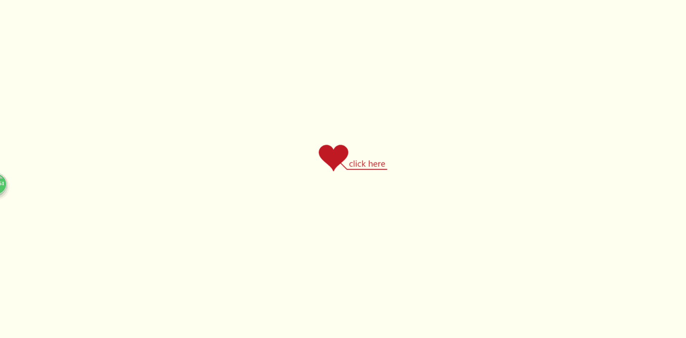
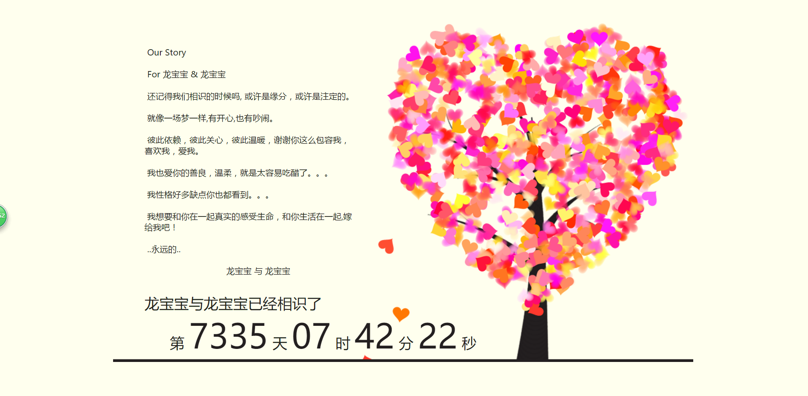

# 告白网页

偶然在网上看到了这个页面，其实已经烂大街了算是，不过，大家拿来骗一下小白妹子还是可以的。我也不清楚原页面的作者是谁，目前里面的代码是在网上随便找了一个页面截取的。

【版权声明】

本人并不具有这个网页的版权，如涉及侵权请联系我。

我主要贴出这个页面自定义部分在哪里，给大家省去自己去找的时间，并且重新整理了文件和代码格式。

所有的源码放在src目录下。

首先看一下效果吧。



## 自定义的部分

**第一张图片"Click Here"的文字，位于js/love.js:172**

```javascript
ctx.font = "12px 微软雅黑,Verdana";
ctx.fillText("click here", 23, 16);
```

**第二张图片中Our Stroy直接写在index.html中的**

```html
<span class="say"> Our Story</span><br>
<span class="say"> </span><br>
<span class="say"> For  龙宝宝 &amp;  龙宝宝 </span><br>
<span class="say"> </span><br>
<span class="say"> 还记得我们相识的时候吗, 或许是缘分，或许是注定的。</span><br>
<span class="say"> </span><br>
<span class="say"> 就像一场梦一样,有开心,也有吵闹。</span><br>
<span class="say"> </span><br>
<span class="say"> 彼此依赖，彼此关心，彼此温暖，谢谢你这么包容我，喜欢我，爱我。</span><br>
<span class="say"> </span><br>
<span class="say"> 我也爱你的善良，温柔，就是太容易吃醋了。。。</span><br>
<span class="say"> </span><br>
<span class="say"> 我性格好多缺点你也都看到。。。</span><br>
<span class="say"> </span><br>
<span class="say"> 我想要和你在一起真实的感受生命，和你生活在一起,嫁给我吧！</span><br>
<span class="say"> </span><br>
<span class="say"> ..永远的..</span><br>
<span class="say"> </span><br>
<span class="say"><span class="space"></span>龙宝宝 与 龙宝宝</span>
```

**第二张图片中的时间初始值设置在index.html最底部的script中**

``` javascript
var textAnimate = eval(Jscex.compile("async",
function() {
	var together = new Date();
	together.setFullYear(1996, 11, 16); //时间年月日
	together.setHours(12); //小时	
	together.setMinutes(0); //分钟
	together.setSeconds(0); //秒前一位
	together.setMilliseconds(0); //秒第二位
	$("#code").show().typewriter();
	$("#clock-box").fadeIn(500);
	while (true) {
		timeElapse(together);
		$await(Jscex.Async.sleep(1000));
	}
```

如果各位有更多想改动的，请自行发挥吧。

祝天下有情人终成眷属。 ⁄(⁄ ⁄•⁄ω⁄•⁄ ⁄)⁄
